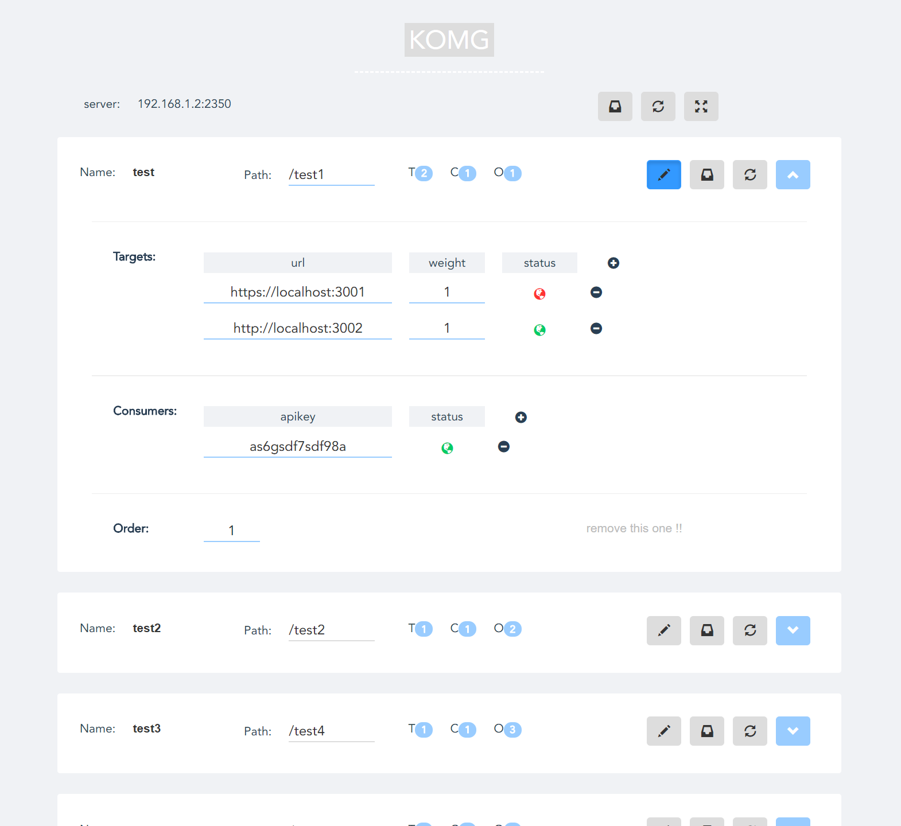

# komg

[![NPM Version][npm-image]][npm-url]

a mini kong, lightweight microservices manager.

## Admin UI



## Install

```bash

npm i -g komg

```

## Run

```bash

komg

or

komg --port=2350 --db=./db.json --env=prod --redis=redis://127.0.0.1:6379/0 --basic-auth=name1=pass1

```

then open http://localhost:2350/admin with your browser


## Argv

 - -p/--port, set port for http server, default 2350
 - --db, set db path, default $komg/lib/db_test.json
 - --env, dev/prod, default dev(allow all requests without apikey)
 - --redis, redis url
 - --basic-auth, add a basic authorization for admin
 

## Usage
 
 - 1.if you add a api like this
 
 ```json
{
   "name": "test",
   "path": "/test",
   "targets": [
     {
       "url": "http://localhost:3001",
       "weight": 1,
       "status": 1
     }
   ],
   "consumers": [
     {
       "apikey": "All",
       "status": 1
     }
   ],
   "order": 1
}
 ``` 

your request to `http://localhost:2350/test` will be proxy to `http://localhost:3001`

 - 2.if you add a api like this

 ```json
{
   "name": "test2",
   "path": "/test2",
   "targets": [
     {
       "url": "http://localhost:3002",
       "weight": 1,
       "status": 1
     }
   ],
   "consumers": [
     {
       "apikey": "adsf1324asdfg",
       "status": 1
     }
   ],
   "order": 1
}
 ``` 
 
your request to `http://localhost:2350/test2` will be asked a apikey in the headers, like this headers:{Content-Type:'application/json',apikey:'adsf1324asdfg'}


[npm-image]: https://img.shields.io/npm/v/komg.svg
[npm-url]: https://www.npmjs.com/package/komg