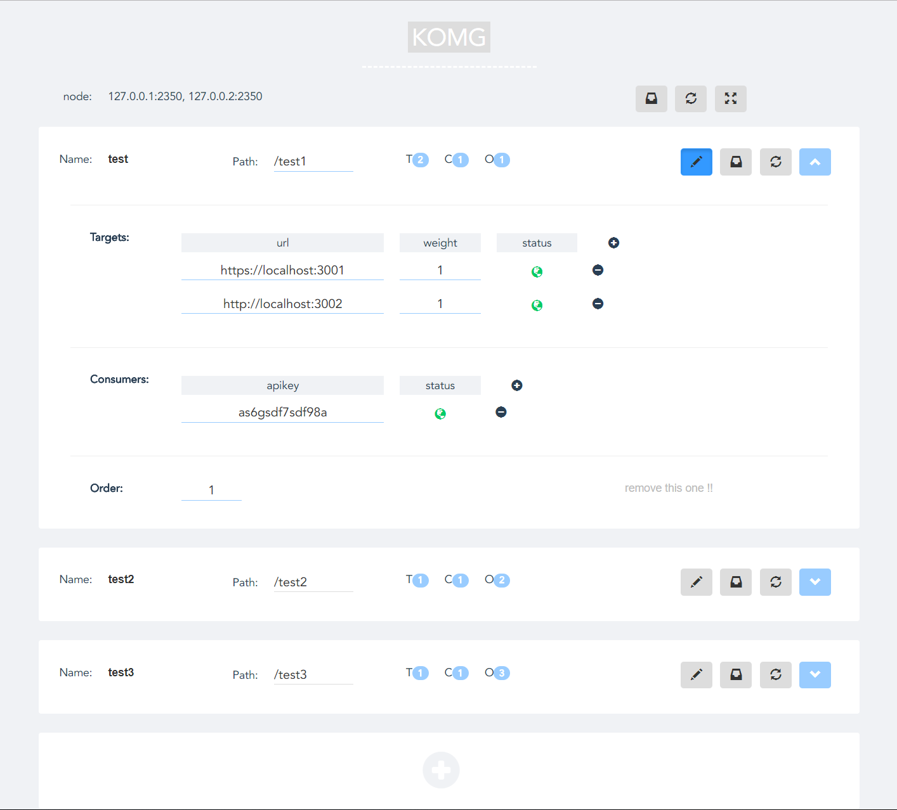

# komg

[![NPM Version][npm-image]][npm-url]

a mini kong, lightweight microservices manager.

coding ... (ง๑ •̀_•́)ง


## Admin UI



## start

```bash

git clone

```

## run

```bash

node app.js

```


## api

 - asdfg
 - zxcvb


[npm-image]: https://img.shields.io/npm/v/komg.svg
[npm-url]: https://www.npmjs.com/package/komg